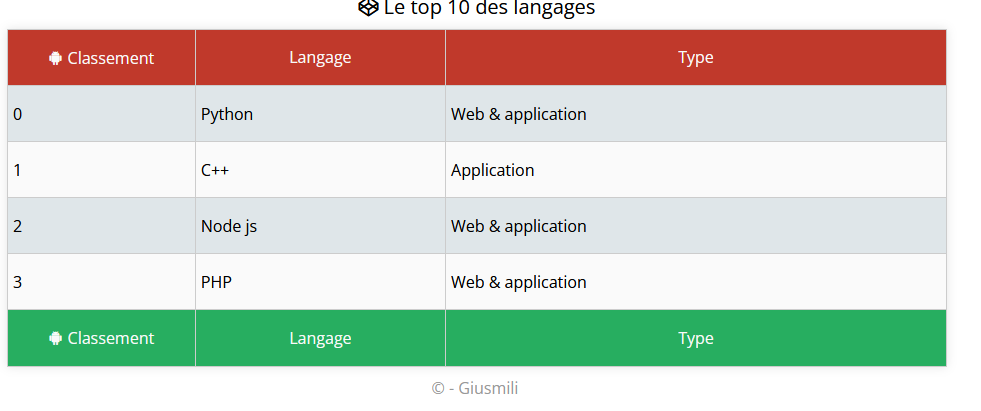

# Créer un tableau php 🧑‍💻

>D'après ce que vous avez en html vous devez reconstituer un tableau de données en php. Pour parcourir les donnée et les afficher dans la structure html vous devriez vous servir d'une boucle **foreach**. Vous devez compter le nombre d'itérations et afficher l'index pour chaque ligne du tableau

```php
$_topTenLang = array(
            0=>array("Python" => "Web & application"),
            1=>array("C++" => "Application"),
            5=>array("Node js" => "Application"),
            3=>array("PHP" => "Web & application")
     );

```
>Une fois le tableau terminé faites des tests php pour voir si tout vas bien. 
En suite il faut intégrer les données dynamiquement dans le tableau html: Il va falloir recréer un fichier php avec la structure html de base et dynamiser l'affichage du tableau.